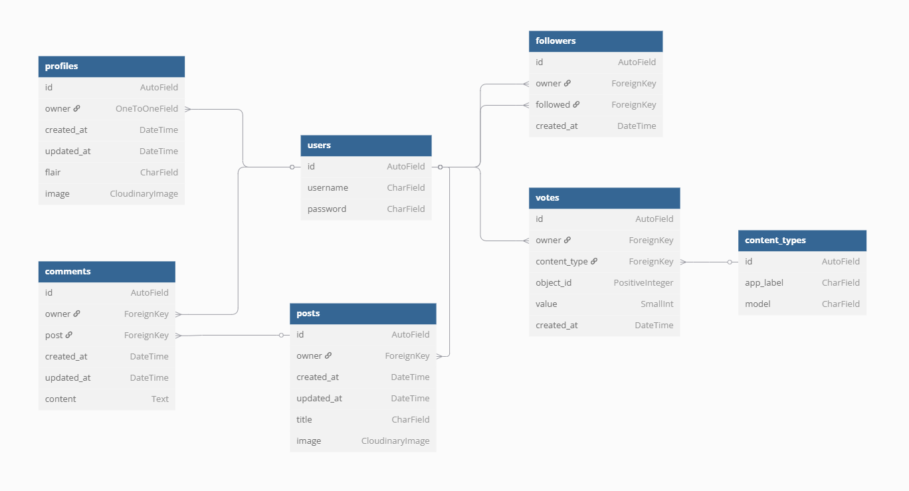

# Memer DRF-API
The **Memer DRF API** is the backend service for the **Memer application**, 
built with Django REST Framework. It powers a social platform centered around 
meme sharing, enabling users to post content, engage through comments, and 
participate in voting to foster community interaction.

Core Applications
- **Profiles:** Manages user profiles and associated data.
- **Followers:** Handles user follow and follower relationships.
- **Posts:** Facilitates the creation and management of meme posts.
- **Comments:** Supports user discussions through commenting on posts.
- **Votes:** Implements voting mechanisms for user engagement.
- **Utils:** Contains auxiliary utilities to support core functionalities.
- **Memer_drf:** Configures the main application setup.

Deployed API: [Memer DRF-API](https://memer-ci-4df2cf031c89.herokuapp.com/) 
API Github: [Repository](https://github.com/almost-good/memer-drf) 
Deployed React App: XXXXXXXXXXXXXXXXXXXXXXXXXXXXXXXXXXXXXXXXXXXXXXXXXXXX 
React App Github: XXXXXXXXXXXXXXXXXXXXXXXXXXXXXXXXXXXXXXXXXXXXXXXXXXXXXXXXXXX

## Table of Contents
- [Data Model](#database)
  * [ERD](#erd)
  * [DB Structure](#db-structure)
- [API Endpoints](#api-endpoints)
- [Testing](#testing) xxxxxxxxxxxxxxxxxxxxxxxxxxxxxxxxxxxxxxxxxxxxxxxxxx
- [Deployment](#deployment) xxxxxxxxxxxxxxxxxxxxxxxxxxxxxxxxxxxxxxxxxxxxxxxxx
- [Technologies Used](#technologies-used) xxxxxxxxxxxxxxxxxxxxxxxxxxxxxxxxxxxx
  * [Languages](#languages) xxxxxxxxxxxxxxxxxxxxxxxxxxxxxxxxxxxxxxxxxxxxxxxx
  * [Frameworks, Libraries and Packages](#frameworks-libraries-and-packages) xxxxxxxxxxxxxxxxxxxxxxxxx
  * [Tools](#tools) xxxxxxxxxxxxxxxxxxxxxxxxxxxxxxxxxxxxxxxxxxxxxx
- [Credits](#credits) xxxxxxxxxxxxxxxxxxxxxxxxxxxxxxxxxxxxxxxxxxxxxxxxx

## Data Model

For database creation [PostgreSQL](https://www.postgresql.org/) was used, 
provided by Code Institute. To create entity relationship diagram I used 
[Dbdiagram](https://dbdiagram.io/).

### ERD

### DB Structure
Relationships:
- **User** to *Profile:* One-to-One
- **User** to *Follower:* Many-to-Many 
  * Self referential, through Follower model.
  * Each user can follow many users and be followed by many.
- **User** to *Post:* One-to-Many
- **User** to *Comment:* One-to-Many
- **User** to *Vote:* One-to-Many
- **Follower** to *User:* Many-to-One
  * For owner and followed.
- **Post** to *Comment:* One-to-Many
- **Vote** to *Post:* Polymorphic
  * GenericForeignKey using 'content_type' and 'object_id'
- **Vote** to *Comment:* Polymorphic
  * GenericForeignKey using 'content_type' and 'object_id'

## API Endpoins
Api endpoints including HTTP and CRUD operations.

|ENDPOINT                   |HTTP       |CRUD   |
|---------------------------|-----------|-------|
|dj-rest-auth/registration/ |POST	    |Create |
|dj-rest-auth/login/	    |POST	    |Read   |
|dj-rest-auth/logout/	    |POST	    |Delete |
|profiles/	                |GET	    |Read   |
|profiles/\<int:pk>/	    |GET	    |Read   |
|	                        |PUT	    |Update |
|posts/	                    |GET	    |Read   |
|	                        |POST	    |Create |
|posts/\<int:pk>/	        |GET	    |Read   |
|	                        |PUT	    |Update |
|	                        |DELETE	    |Delete |
|comments/	                |GET	    |Read   |
|	                        |POST	    |Create |
|comments/\<int:pk>/        |GET	    |Read   |
|	                        |PUT	    |Update |
|	                        |DELETE	    |Delete |
|followers/	                |GET	    |Read   |
|	                        |POST	    |Create |
|followers/\<int:pk>/	    |GET	    |Read   |
|	                        |DELETE	    |Delete |
|votes/	                    |GET	    |Read   |
|	                        |POST	    |Create |
|		                    |           |Update |
|		                    |           |Delete |

## Testing
xxxxxxxxxxxxxxxxxxxxxxxxxxxxxxxxxxxxxxxx
xxxxxxxxxxxxxxxxxxxxxxxxxxxxxxxxxxxxxxxx

## Deployment
xxxxxxxxxxxxxxxxxxxxxxxxxxxxxxxxxxxxxxxx
xxxxxxxxxxxxxxxxxxxxxxxxxxxxxxxxxxxxxxxx

## Technologies Used

### Languages
xxxxxxxxxxxxxxxxxxxxxxxxxxxxxxxxxxxxxxxx
xxxxxxxxxxxxxxxxxxxxxxxxxxxxxxxxxxxxxxxx

### Frameworks, Libraries and Packages
xxxxxxxxxxxxxxxxxxxxxxxxxxxxxxxxxxxxxxxx
xxxxxxxxxxxxxxxxxxxxxxxxxxxxxxxxxxxxxxxx

### Tools
xxxxxxxxxxxxxxxxxxxxxxxxxxxxxxxxxxxxxxxx
xxxxxxxxxxxxxxxxxxxxxxxxxxxxxxxxxxxxxxxx

## Credits
xxxxxxxxxxxxxxxxxxxxxxxxxxxxxxxxxxxxxxxx
xxxxxxxxxxxxxxxxxxxxxxxxxxxxxxxxxxxxxxxx